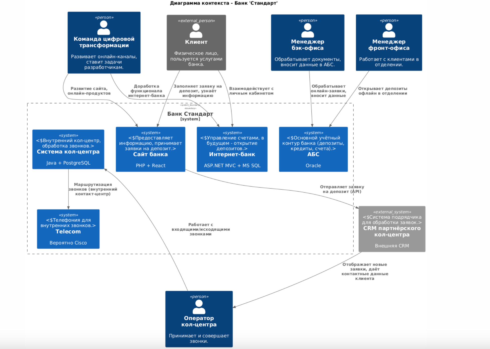
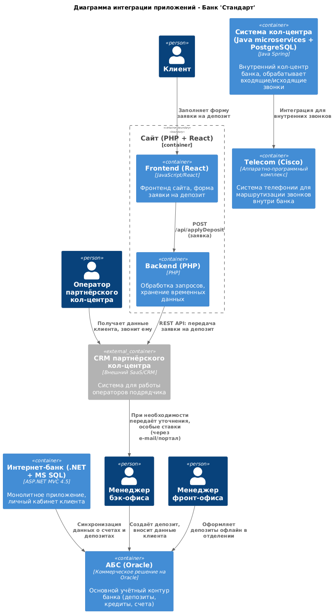
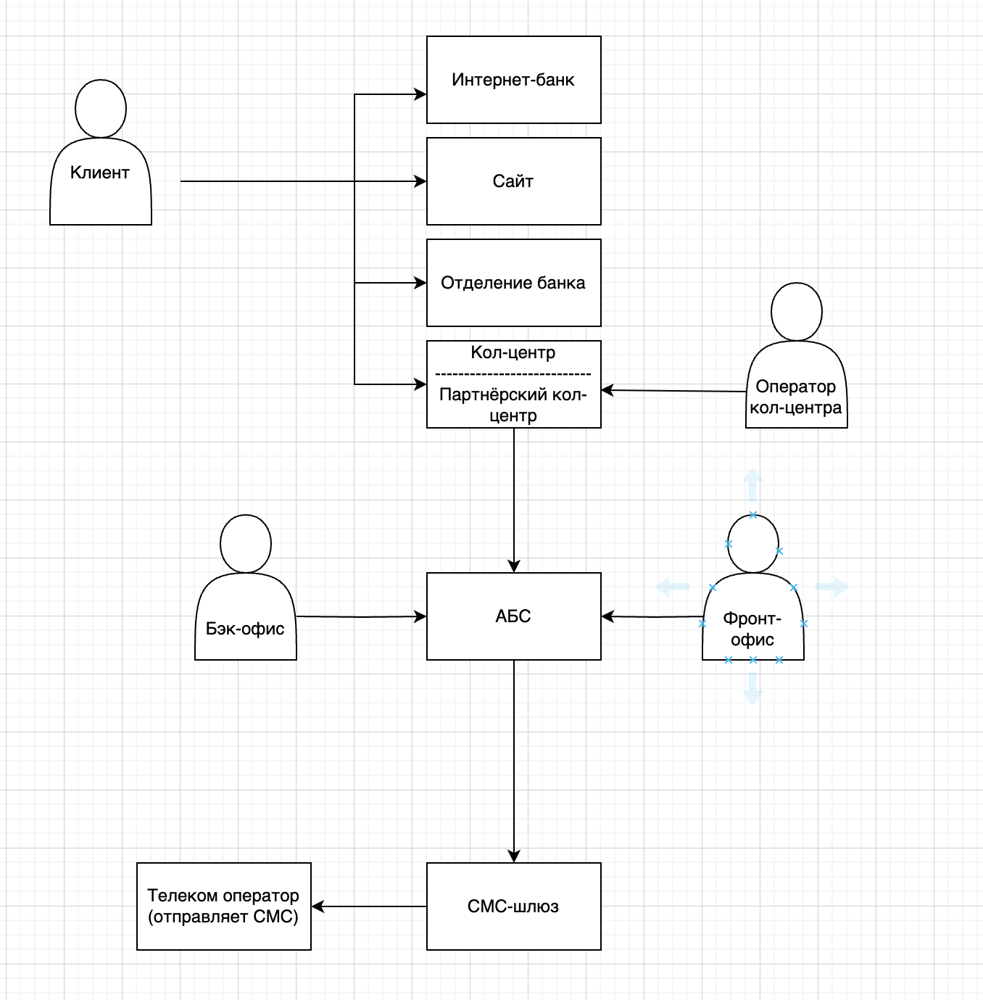

## Задание 1. Что нужно сделать

У вас есть *Business Capability Map*, а также описание организационной структуры предприятия и процессов. На основе этих данных создайте в `draw.io`:

1. **Карту текущего IT-ландшафта.**
    - В строках она должна содержать элементы организационной структуры.
    - В столбцах — бизнес-возможности этих процессов.
    - *Например:* в строке стоит кол-центр, а в колонке — продажи через кол-центр.

2. **Схему интеграции приложений** с указанием участников процессов.

Когда всё будет готово, загрузите артефакты в директорию `Exs1` в рамках пул-реквеста.

**1. Карта ИТ-ландшафта**

|                                        | Продажи в сети отделений | Продажи через кол-центр | Digital-оповещения клиентов | Обслуживание депозитных процессов | Обслуживание кредитных процессов | Управление договорами |
|----------------------------------------|---------------------------|-------------------------|-----------------------------|------------------------------------|-----------------------------------|-----------------------|
| **Управление обслуживанием в сети отделений**                |                           |                         |                             |                                    |                                   |                       |
| **Управление IT**                      | Офисы + Telecom          |                         |                             |                                    |                                   |                       |
| **Управление обслуживанием депозитных продуктов**            |                           |                         |                             | АБС                                |                                   |                       |
| **Управление обслуживанием кредитных продуктов**             |                           |                         |                             |                                    | АБС                               |                       |
| **Кол-центр банка «Стандарт»**                                |                           | Система кол-центра      |                             |                                    |                                   |                       |
| **Партнёрский кол-центр**             |                           | CRM партнёрского кол-центра |                             |                                    |                                   |                       |
| **Команда цифровой трансформации розничного бизнеса**        |                           |                         | Digital-каналы (сайт, интернет-банк, соцсети) |                         |                                   |                       |

**2. Схема интеграции приложений (как в С1, так и упрощенная в draw io)**

Диаграмма контекста

Диаграмма контейнеров

упрощенно в draw io можно сделать такой рисунок

### Пояснения к интеграции

1.1. **Сайт (PHP + React)**
- Клиент отправляет заявку на депозит через форму (React).
- Backend на PHP сохраняет заявку (временные данные) и передаёт её во внешнюю CRM партнёрского кол-центра по API.

1.2. **Партнёрский кол-центр (CRM)**
- Получает заявку. Оператор обзванивает клиента, уточняет детали.
- Если нужны особые условия, заявка может быть передана менеджерам бэк-офиса для ручной донастройки (например, через внутренний портал или электронную почту).

1.3. **Менеджер бэк-офиса**
- При подтверждении всех условий создаёт депозит в АБС.
- АБС — основной реестр счетов, депозитов, кредитов.

1.4. **Интернет-банк**
- Синхронизируется с АБС, чтобы клиент увидел свой депозит, открытый менеджером. В будущем планируется полностью автоматическое открытие без участия бэк-офиса.

1.5. **Система кол-центра**
- Отдельная система для внутреннего кол-центра (сотрудники банка). Интегрирована с системой телефонии (Telecom).

1.6. **Telecom (Cisco)**
- Обеспечивает маршрутизацию звонков внутри банка (включая фронт-офис, бэк-офис, внутренний кол-центр).
- Партнёрский кол-центр пользуется собственной CRM и собственной телефонией, но для некоторых сценариев может быть взаимодействие через общие каналы связи (например, переадресация звонков).