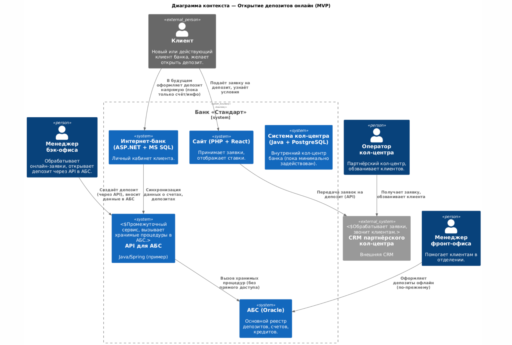
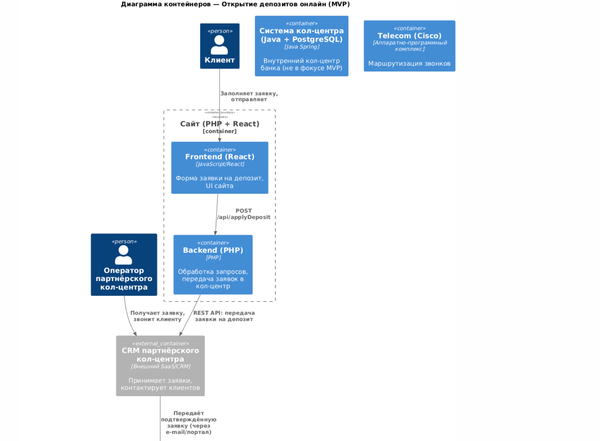
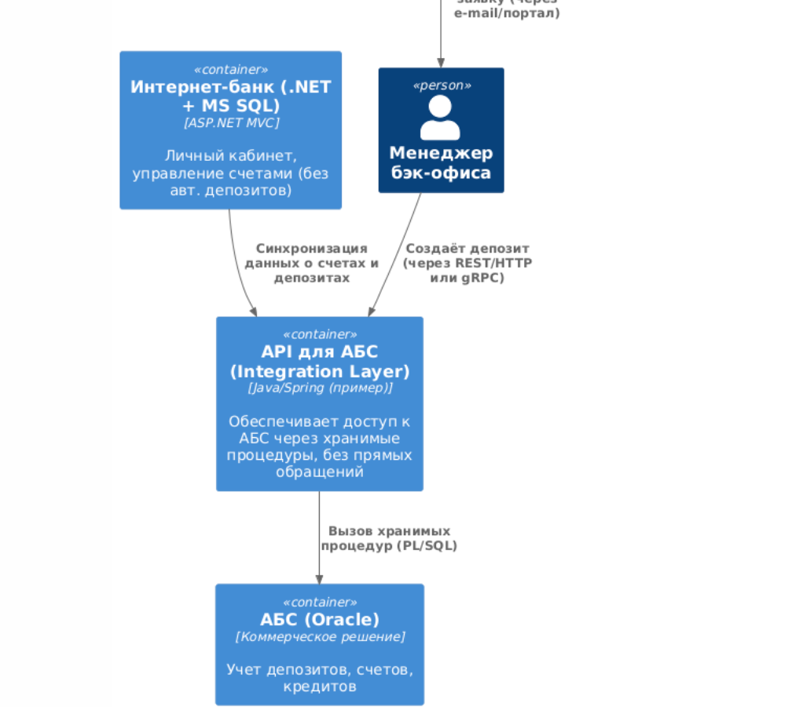

# Architecture Decision Record (ADR)

## Название задачи
Открытие депозитов онлайн (MVP) с использованием промежуточного API для АБС

## Дата
02.03.2025

## Контекст
Банк «Стандарт» планирует предоставить клиентам возможность открывать депозиты онлайн. Сейчас основные процессы (открытие, оформление) проходят офлайн в отделении. Цель MVP — дать клиенту базовый функционал подачи заявки на депозит через сайт/интернет-банк и автоматизировать работу бэк-офиса, но при этом **не обращаться к АБС напрямую**, а использовать отдельный сервис/API для интеграции.

## Функциональные требования

| №  | Действующие лица или системы | Use Case                                            | Описание                                                                                               |
|----|------------------------------|------------------------------------------------------|---------------------------------------------------------------------------------------------------------|
| 1  | Клиент                       | Подача заявки на депозит через сайт                 | Клиент выбирает депозит, вводит данные и оставляет заявку                                              |
| 2  | Клиент                       | Подача заявки на депозит через интернет-банк        | Клиент заходит в личный кабинет, указывает сумму и счёт, подтверждает через СМС                         |
| 3  | Бэк-офис                     | Обработка заявки из интернет-банка                 | Менеджер проверяет заявку, открывает депозит в АБС                                                      |
| 4  | Клиент                       | Просмотр статуса заявки в интернет-банке           | Клиент видит, на какой стадии находится заявка                                                          |
| 5  | СМС-шлюз                     | Уведомление клиента                                 | Клиент получает СМС о подтверждении депозита                                                            |

---

## Нефункциональные требования

| №  | Требование                                                                                                        |
|----|-------------------------------------------------------------------------------------------------------------------|
| 1  | Доступность 99.99% (переключение на резервный ЦОД в случае сбоя)                                                 |
| 2  | Время ответа менее 1 секунды при работе с формой заявки                                                          |
| 3  | Шифрование канала связи (TLS), двухфакторная аутентификация                                                      |
| 4  | Горизонтальное масштабирование интернет-банка (нагрузка может расти при увеличении числа клиентов)               |
| 5  | Минимизация ручных операций в бэк-офисе, чтобы повысить производительность и снизить вероятность человеческих ошибок |

### Текущие ограничения и предпосылки
1. **АБС (Oracle)** — основной учётный контур банка. Доступ к базе строго через хранимые процедуры и согласованные интерфейсы.
2. **Интернет-банк (ASP.NET + MS SQL)** — монолит, развёрнут в ЦОД. Пока не умеет открывать депозиты автоматически.
3. **Сайт (PHP + React)** — умеет собирать заявки, отправляет их в CRM партнёрского кол-центра.
4. **Партнёрский кол-центр (CRM)** — принимает заявки и звонит клиенту для уточнения. В MVP хотим частично задействовать кол-центр, пока система не станет полностью самообслуживаемой.
5. **Требование**: Не подключаться к АБС напрямую, а использовать промежуточный сервис (API), который будет вызывать нужные хранимые процедуры и/или методы внутри периметра банка. Это повышает безопасность и упрощает поддержку.

---

## Предлагаемое решение

### 1. Диаграмма контекста (C4: Context)

Ниже PlantUML-код для **диаграммы контекста**, показывающей основных акторов и системы (включая промежуточный API для работы с АБС):

### Описание

1. Клиент подает заявку на сайте → Заявка попадает во внешнюю CRM кол-центра.
2. Оператор связывается с клиентом, подтверждает заявку, передает подтвержденную заявку менеджеру бэк-офиса.
3. Менеджер бэк-офиса обращается к API для АБС (а не напрямую к базе), чтобы создать депозит.
4. Интернет-банк также использует эти API, чтобы получать/отображать информацию о депозитах.

---

### 2. Диаграмма контейнеров (C4: Container)

Ниже более детальная Container-диаграмма с учетом промежуточного API (Integration Layer):

### Описание

- Сайт разбит на **frontend** (React) и **backend** (PHP).
- **Партнёрская CRM** получает заявки, заносит в **АБС** после подтверждения.
- **Менеджер бэк-офиса** открывает депозит в **АБС** после подтверждения.
- **Интернет-банк** пока что только отображает данные о депозитах (из АБС), но не позволяет их открывать автоматически.

### Use Cases

| Лица и стейкхолдеры | Use Case                                  | Описание                                                                                                                              |
|---------------------|-------------------------------------------|---------------------------------------------------------------------------------------------------------------------------------------|
| Клиент              | Выбирает депозит, заполняет заявку (MVP)  | Заходит на сайт, выбирает продукт «депозит», вводит свои данные, отправляет заявку.                                                   |
| Оператор колл-центра| Принимает заявку, звонит клиенту          | Заявка уходит в CRM, оператор связывается с клиентом, уточняет детали, подтверждает, заносит в АБС.                                   |
| Менеджер бэк-офиса  | Открывает депозит в АБС                   | Получает информацию о подтверждённой заявке, открывает депозит.                                                                       |
| Клиент              | Видит открытый депозит в интернет-банке   | Авторизуется в интернет-банке, просматривает информацию об открытых депозитах и баланс клиента.                                       |

## Требования и архитектурно-значимые решения

### 1. Интеграция с АБС
- Обеспечить отдельный сервис API для АБС, который вызывает хранимые процедуры.
- Прямое подключение к БД Oracle из других систем запрещено.

### 2. Безопасность
- Все соединения должны быть защищены (TLS).
- Уровень доступа менеджерского бэк-офиса ограничен (только необходимое минимум).

### 3. Упрощенная логика MVP
- Пока интернет не может отгружать полностью самостоятельно в интернет-банк — менеджер бэк-офиса участвует.
- Пока нет адресной афды, досылать пакет документов или загружать вручную.

---

### Альтернативы

- **Прямое подключение к АБС**  
  Нарушает принцип безопасной интеграции. Не исключены риски, нет чёткой межсервисной границы.

- **Сразу полнофункциональный интернет-банк (без участия бэк-офиса)**  
  Слишком сложно и долго. Нужна адресная афда, онлайн-подписание, может закрывать задачи MVP.

---

### Риски и ограничения
- Безопасность, хранение персональных данных и построение партнёрского колл-центра в приоритете во всех системах.
- Нужен не абфди: сервис для отгрузки заявок, после формирования снаружи (например, Kubernetes, Docker).
- На первом этапе: пока адресна-к идентификация (прописка, биометрия) без урезания может потребовать доработки профиля клиента.

### Решение

1. **Реализовать отдельный API для АБС (Integration Layer):**
    - Любая внешняя система (сайт, интернет-банк, бэк-офис) обращается к базе Oracle только через этот сервис.
    - Сервис управляет вызовами хранимых процедур, обеспечивает контроль безопасности и журналирование.

2. **Сохранить MVP-подход:**
    - Сайт → CRM кол-центра → Менеджер бэк-офиса → `absApi` → АБС.
    - Интернет-банк отображает данные о депозитах, вызывая `absApi` для чтения.

3. **План дальнейшего развития:**
    - Добавить возможность прямого открытия депозита в интернет-банке (без менеджера).
    - Расширить `absApi` проверками, интеграцией с системами скоринга и т.д.

Таким образом, обеспечиваем:
- Безопасный доступ к АБС (без прямых подключений).
- Централизованное управление нагрузкой и логикой открытия депозитов.
- Пошаговое развитие к полной автоматизации (в будущем).