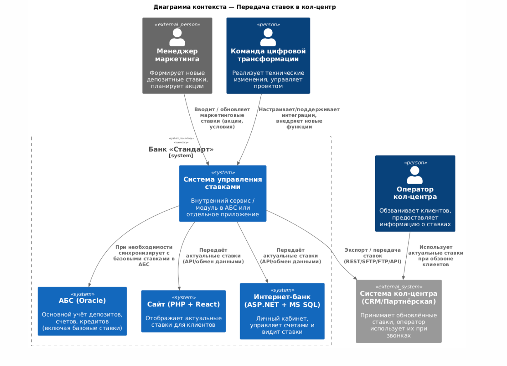
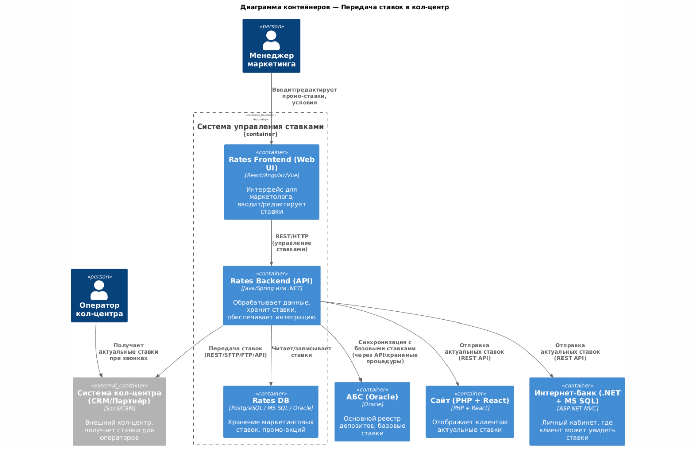

### **Название задачи:** Передача ставок в кол-центр

## Дата
02.03.2025

---

### **Функциональные требования**

| **№** | **Действующие лица или системы** | **Use Case** | **Описание**                                          |
|----|----|----|-------------------------------------------------------|
| 1 | Клиент | Звонок в кол-центр для уточнения ставки | Клиент хочет узнать текущую ставку по депозиту        |
| 2 | Оператор кол-центра | Просмотр актуальной ставки | Оператор должен иметь доступ к актуальной информации  |
| 3 | Партнёрский кол-центр | Получение актуальных ставок | Получение ставок в виде файлов через SFTP             |
| 4 | Система банка | Передача ставок в кол-центр | Интеграция системы ставок с системой кол-центра       |
| 5 | Система банка | Формирование файла ставок | Автоматическое создание файла для передачи            |

---

### **Нефункциональные требования**

|  №  |  Требование  |
|-----|-------|
| 1 | Обновление ставок должно происходить не реже 1 раза в день |
| 2 | Безопасная передача файлов (шифрование SFTP) |
| 3 | Минимизация нагрузки на базу данных при обработке ставок |
| 4 | Высокая доступность системы ставок |

---

### **Решение**

#### **Диаграммы**

Диаграммы контекста и контейнеров представлены в отдельных файлах:

- `C4Context.puml` — Диаграмма контекста

#### **Краткое описание:**

- Менеджер маркетинга формирует новые ставки (акции, специальные условия) в системе управления ставками.
- Эта система может при необходимости синхронизироваться с АБС (если базовые ставки берутся из АБС) или наоборот, обновлять там нужную информацию.
- Сайт и интернет-банк получают актуальные ставки, чтобы клиенты видели их онлайн.
- Система кол-центра (внешняя или партнёрская CRM) также получает эти ставки, чтобы операторы могли озвучивать клиентам точную информацию.

- `C4Container.puml` — Диаграмма контейнеров

#### **Краткое описание:**

- **Rates Frontend**: Веб-интерфейс для менеджера маркетинга, где он вводит или редактирует ставки.
- **Rates Backend**: Серверная часть, которая обрабатывает логику, хранит ставки в Rates DB и передаёт их в другие системы.
- **АБС**: Может быть источником базовых ставок или местом, где нужно обновлять определённые данные, если это предусмотрено внутренними процессами.
- **Сайт** и **Интернет-банк** получают ставки от Rates Backend.
- **Система кол-центра (CRM)** тоже подключается к Rates Backend через REST API или другой протокол (SFTP/FTP). Оператор кол-центра использует полученную информацию для консультаций клиентов.

#### **Дополнительно:**

- В рамках MVP может быть достаточно, если Rates Backend экспортирует CSV/JSON-файл по SFTP раз в час в систему кол-центра. Но для более оперативного обновления целесообразно реализовать API (REST/GraphQL) или шину сообщений (Kafka/ActiveMQ).
- Если кол-центр — внешний подрядчик, нужно учесть безопасность (VPN, TLS, ограничение IP-адресов).
- В дальнейшем можно расширить Rates System механизмами автоматического пересчёта ставок, интеграцией с CRM и т.д.

Таким образом, эти две диаграммы (Context и Container) показывают, кто и какие системы участвуют в передаче ставок, а также как они могут взаимодействовать на более детальном уровне.

#### **Основные компоненты и интеграции:**

1. **Система банка** генерирует файл со ставками.
2. **Файл передаётся** по SFTP в партнёрский кол-центр.
3. **Внутренний кол-центр** получает ставки через API.
4. **Операторы могут просматривать ставки** в системе.

#### **Выбор технологий:**
- **SFTP** — передача файлов в партнёрский кол-центр
- **REST API** — передача ставок в основной кол-центр
- **MS SQL, Oracle** — база данных ставок
- **Шифрование** — безопасность передачи файлов

---

### **Альтернативы**

| Альтернатива | Плюсы | Минусы |
|-------------|-------|--------|
| Использование API для партнёрского кол-центра | Автоматизация, мгновенная передача | Партнёр не поддерживает API |
| Ручная передача файлов | Простота | Высокая нагрузка на операторов |
| Автоматическая передача через SFTP | Минимизация ошибок, автоматизация | Требуется настройка безопасности |

---

### **Недостатки, ограничения, риски**

- **Риск перегрузки системы ставок**: необходимо кеширование данных.
- **Ограниченный доступ к партнёрскому кол-центру**: требуется формат передачи через файлы.
- **Необходимость защиты данных**: требуется шифрование файлов.
- **Регулярное обновление ставок**: ставки должны передаваться минимум раз в день.

---
